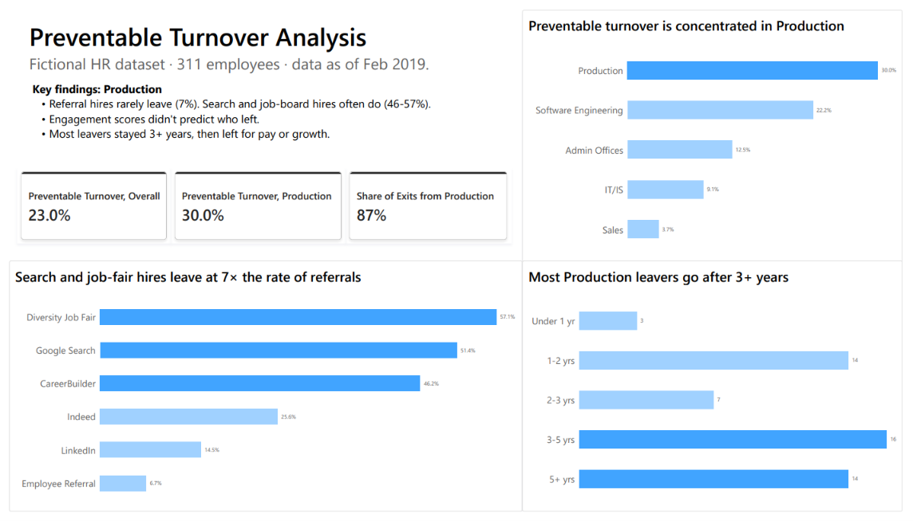

# HR Turnover Analysis

Which employees leave for reasons a company could have prevented, and where should retention efforts focus?



## Key findings

- **23% preventable turnover.** 62 of 269 employees left for reasons the company could have influenced: another job, unhappiness, pay, hours, or a career change.
- **Production drives it.** A 30% preventable turnover rate, and 54 of the 62 preventable exits.
- **Three managers stand out.** Their teams have 41–53% preventable turnover, against 23% overall.
- **Recruitment source matters.** Google Search, Diversity Job Fair, and CareerBuilder hires leave at 33–50%, while Employee Referral and LinkedIn hires leave at 4–15%.
- **Most leavers are established employees.** 34 of the 62 preventable exits came after 3+ years, most often for another position or unhappiness.
- **Engagement scores didn't predict who left.** Leavers and stayers scored almost the same (4.09 vs. 4.12).

## Files

| File | Description |
| --- | --- |
| [`hr_turnover_analysis.ipynb`](hr_turnover_analysis.ipynb) | Cleaning, exit classification, turnover analysis, and the Power BI export |
| `hr_turnover_for_powerbi.csv` | Cleaned one-row-per-employee table produced by the notebook |
| `hr_turnover_dashboard.pbix` | Power BI dashboard built on the CSV above |
| `HRDataset_v14.csv` | Raw source data |

## Method

1. Trim whitespace in text fields and drop identifying columns (name, zip code).
2. Sort every exit into **preventable**, **unpreventable** (retiring, relocation, school, military, medical, maternity), or **fired**.
3. Compare employees who stayed with those who left for preventable reasons, by department, recruitment source, manager, and tenure. Groups with fewer than 5 employees are excluded.
4. Calculate tenure up to the data snapshot date (2019-02-28) and group it into bands.

## Data

[Human Resources Data Set](https://www.kaggle.com/datasets/rhuebner/human-resources-data-set) (v14) by Dr. Rich Huebner and Dr. Carla Patalano. The dataset is synthetic, created for teaching HR analytics, and all names in it are fictional.

## Running it

```bash
pip install pandas jupyter
jupyter notebook hr_turnover_analysis.ipynb
```

Running all cells regenerates `hr_turnover_for_powerbi.csv`.
